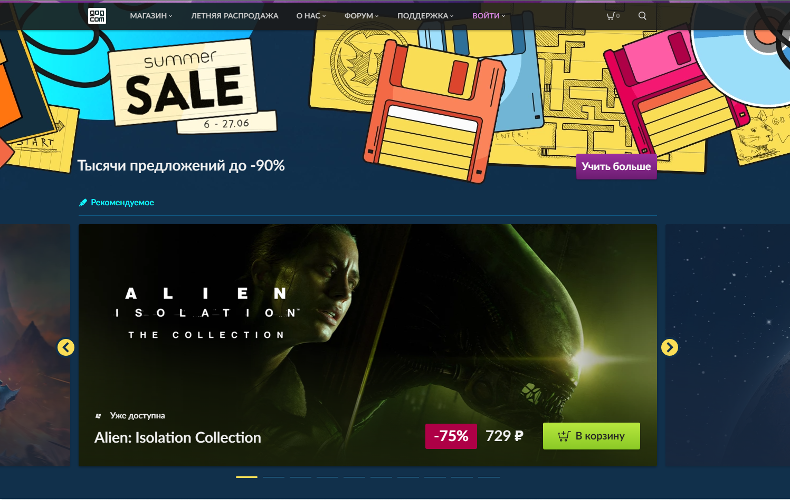
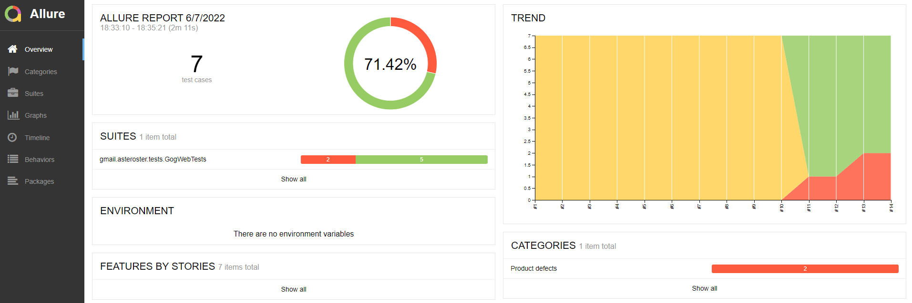
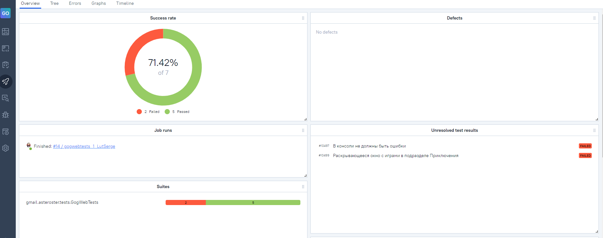
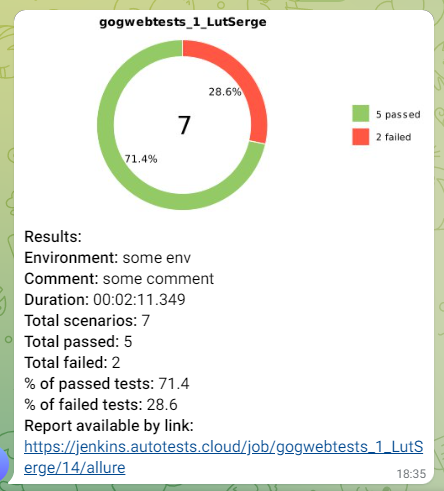
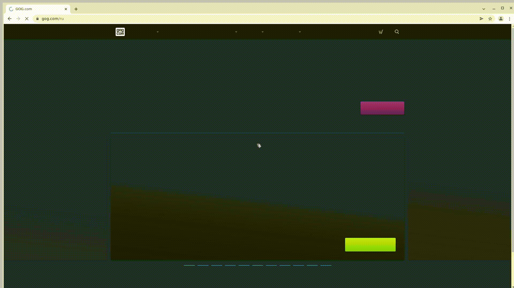

# Проект автоматизированных тестов платформы цифрового магазина [GOG.com](https://www.gog.com/ru)



#Содежание

1. [Стэк](#стэк)
2. [Проверки](#проверки)
3. [Запуск тестов](#запуск-тестов)
4. [Сборка в Jenkins](#Сборка-в-Jenkins)
5. [Allure отчёт](#allure-отчёт)
6. [Видеопример прохождения теста](#видеопример-прохождения-теста)
7. [Уведомления в Telegram](#уведомления-в-Telegram)

## Стэк

<p align="center">


</p>

## Проверки

- Проверка на название в хедере тайтла
- Проверка на наличие ошибок в консоли
- Открытие детальной формы раздела Магазин
- Открытие раздела "Новые игры"
- Проверка появления кророткого меню подразделе "Приключения"
- Переход в раздел "Заказы и оплата"
- Проверика работы поиска после ввода названия игры

## Запуск тестов

#### Параметры запуска
<code>SELENOIDURL</code> - URL хоста для удалённого запуска

<code>BROWSER</code> – браузер, в котором будут выполняться тесты

<code>VERSION</code> - версия браузера, в котором будут выполняться тесты

<code>BROWSER_SIZE</code> – размер окна браузера, в котором будут выполняться тесты (по-умолчанию <code>1920x1080</code>)

<code>BASEURL</code> – URL сайта в котором проходят тесты

#### Локальный запуск с параметрами по-умолчанию
```
gradle clean gogtests
```

#### Локальный запуск с параметерами

```
gradle
clean
gogtests
-Dselenoid=${SELENOIDURL}
-Dbrowser=${BROWSER}
-Dversion=${VERSION}
-DbaseUrl=${BASEURL}
-DbrowserSize=${BROWSERSIZE}
```
#### Запуск с параметрами в Jenkins
```
clean gogtests
-Dselenoid=${SELENOIDURL}
-Dbrowser=${BROWSER}
-Dversion=${VERSION}
-DbaseUrl=${BASEURL}
-DbrowserSize=${BROWSERSIZE}
```
## Сборка в Jenkins
<a target="_blank" href="https://jenkins.autotests.cloud/job/gogwebtests_1_LutSerge/">Сборка</a>

## Allure отчёт
<p align="left">

</p>

## Allure TestOps отчет

<p align="left">

</p>

## Уведомления в Telegram

<p align="left">

</p>

## Видеопример прохождения теста
<p align="left">

</p>